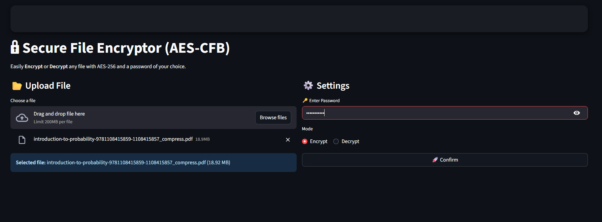

# 🔒 Secure File Encryptor (AES-CFB)

[](https://file-encryptor.streamlit.app/)

A simple and secure web app to **Encrypt** and **Decrypt** files using AES-256 (CFB mode).  
Built with [Streamlit](https://streamlit.io/) and [cryptography](https://cryptography.io/).  

---

## 🚀 Live Demo
👉 [Click here to try the app](https://file-encryptor.streamlit.app/)

---

## ✨ Features
- 🔑 AES-256 encryption with random salt & IV  
- 📂 Supports most file types  
- 🚀 Easy drag-and-drop file upload  
- 📥 Download encrypted/decrypted files instantly  
- 🖤 Minimal, dark-themed UI  

---

## 📸 Preview


---

## 🛠️ Installation (Run Locally)

Clone the repo and install requirements:

```bash
git clone https://github.com/krushaw/file-encryptor.git
cd file-encryptor
pip install -r requirements.txt
